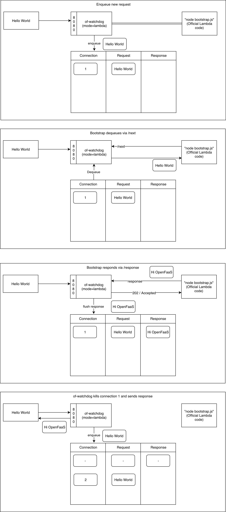

## AWS Lambda Shim for OpenFaaS

This example shows how to run an unmodified AWS Lambda function on OpenFaaS. The same code could be built into an OpenFaaS tempalte as is uploaded to S3 to run on AWS Lambda platform.

This is highly experimental / early-work and only a PoC.

## Run locally

### Run the Lambda runtime

You'll need Node 8, 10 or 11 installed on your local machine.

* Clone Docker Lambda for Node.js 10

```
git clone https://github.com/lambci/node-custom-lambda
cd node-custom-lambda/v10.x
cd test
npm i
cd ..

LAMBDA_TASK_ROOT=./test _HANDLER=".handler" AWS_LAMBDA_RUNTIME_API=127.0.0.1:9000 node bootstrap.js
```

This example uses a function in the "test" folder, edit it if you want to.

### Run the OpenFaaS shim

You'll need Go 1.10 or Go 1.11 installed locally for this part.

* Clone the shim and run it:

```
git clone https://github.com/alexellis/lambda-on-openfaas-poc
cd lambda-on-openfaas-poc

AWS_LAMBDA_FUNCTION_NAME=openfaas port=8080 shim_port=9000 go run main.go
```

### Invoke the Lambda function via the OpenFaaS shim

```
for i in {0..100} ; do  curl localhost:8080 -d '{"invocation": "#: '$i'"}' && echo ; done
```

If you like run this in multiple windows at the same time:

```
(
    for i in {0..100} ; do  curl localhost:8080 -d '{"invocation": "#: '$i'"}' && echo ; done &
    for i in {101..201} ; do  curl localhost:8080 -d '{"invocation": "#: '$i'"}' && echo ; done &
    for i in {202..302} ; do  curl localhost:8080 -d '{"invocation": "#: '$i'"}' && echo ; done &
)
```

## Conceptual diagram



## How do we know it works?

You can test it out using the Node.js tester program in the verify folder.

It verifies that if a request inputs a certain number that it's also echoed in the response.

```
cd verify
npm i
node index.js
```

If all the responses are correct you'll see `[x]` printed back on each line, otherwise the delta.

Test in parallel:

```
(
    node index.js &
    node index.js &
    node index.js &
)
```

## What next?

This code needs packaging as a Docker image to be deployed and run on OpenFaaS. It could be part of the of-watchdog project as an additional mode, i.e. `lambda-shim` or similar.

Is this finished/tested? No it's just an early proof-of-concept. Some internal pub/sub mechanism is probably required.
